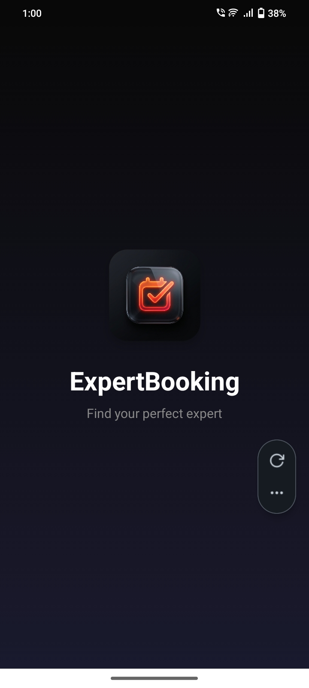
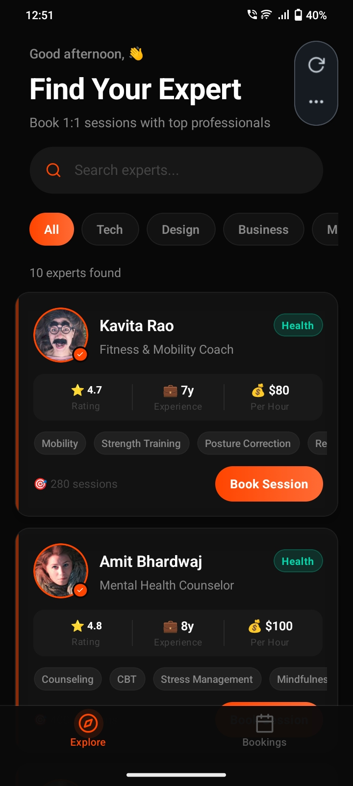
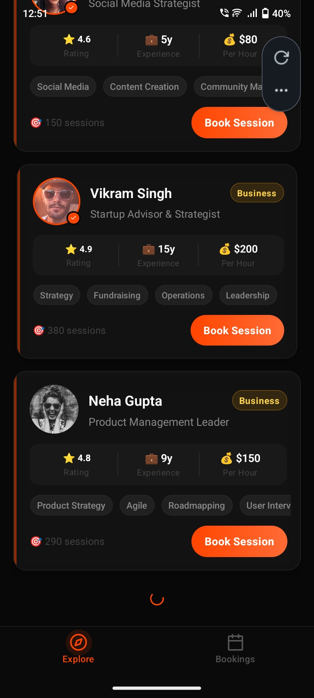
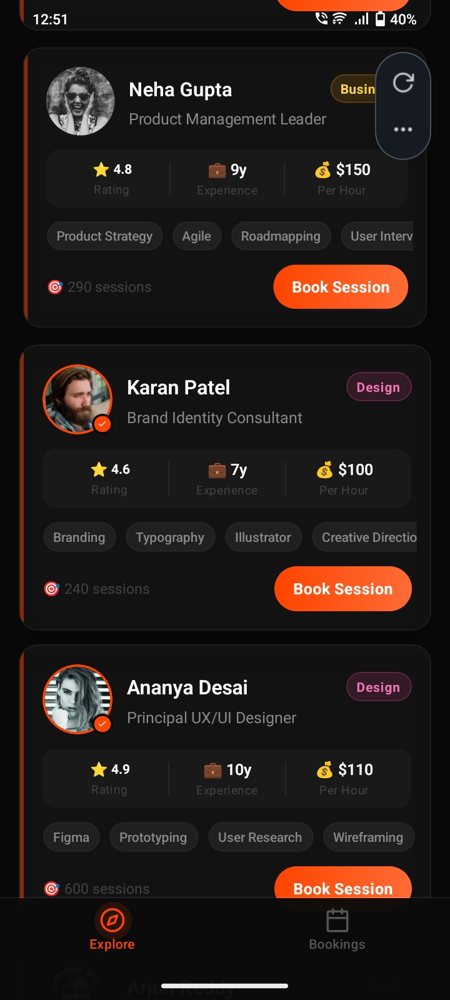
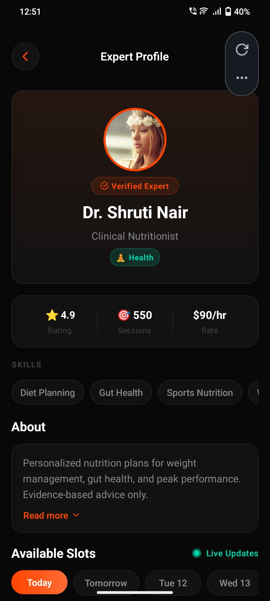
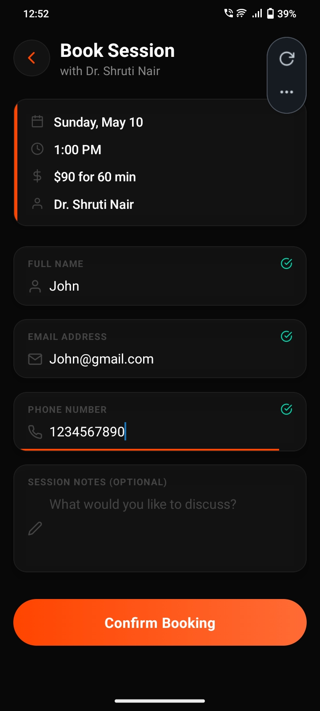
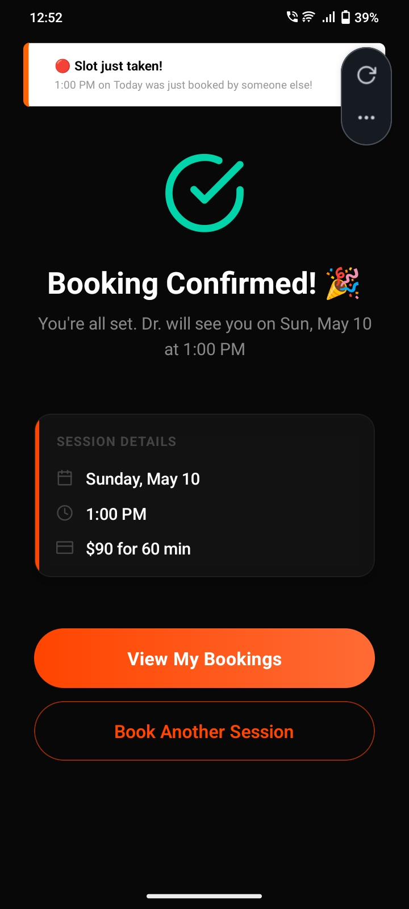
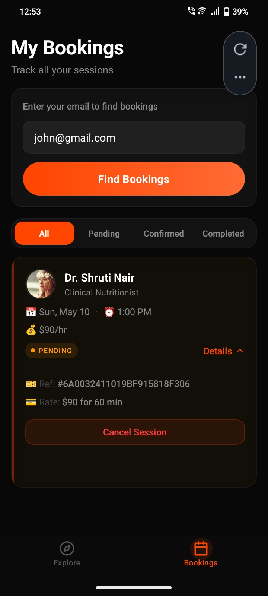

<div align="center">
  
  
  # ExpertBooking
  
  **A premium, full-stack platform connecting users with top professionals for 1:1 sessions.**
  
  [](https://opensource.org/licenses/MIT)
  [](https://reactnative.dev/)
  [](https://expo.dev/)
  [](https://nodejs.org/)
  [](https://expressjs.com/)
  [](https://mongodb.com/)
</div>

<br />

## 🌟 Overview
**ExpertBooking** is a beautifully crafted mobile application designed to seamlessly bridge the gap between people seeking knowledge and top-tier experts. Built with a modern dark-themed aesthetic, fluid animations, and real-time connectivity, it provides an unparalleled user experience from discovery to booking.

## 🚀 Tech Stack

### Frontend (Mobile App)
* **Framework:** React Native & Expo Router (File-based routing)
* **Language:** TypeScript
* **Animations:** React Native Reanimated
* **Styling:** Custom Design System (Premium Dark Theme, Glassmorphism)
* **Data Fetching:** Axios & Custom React Hooks
* **Form Handling:** React Hook Form & Zod

### Backend (API)
* **Runtime:** Node.js
* **Framework:** Express.js
* **Database:** MongoDB & Mongoose
* **Real-time Sync:** Socket.io (for instant slot synchronization)
* **Pagination:** Mongoose-Paginate-V2

---

## 🏗 System Architecture

The platform operates on a decoupled **Client-Server Architecture**:
1. **Presentation Layer (Expo Client):** Handles immersive UI/UX, conditional animations (like our custom animated splash screen), and global state.
2. **Application Layer (Express Server):** Contains the core business logic, structured route controllers, strict data validation middleware, and WebSockets.
3. **Data Layer (MongoDB):** A flexible NoSQL database storing curated expert profiles, dynamic availability slots, and immutable booking records.

### Logic & Workflow
* **Discovery & Pagination:** The mobile app queries the backend `/experts` API using infinite-scroll logic, loading 10 profiles at a time for optimal performance.
* **Booking Ecosystem:** Users filter by category, view rich expert profiles, and select available time slots.
* **Real-Time Engine:** When a booking is confirmed, Socket.io broadcasts the updated slot availability, instantly disabling that specific time slot for all other active users without requiring a pull-to-refresh.

---

## 📸 Application Showcase

Here is a glimpse of the premium interface and user flows:

<div align="center">
  <table>
    <tr>
      <td align="center"></td>
      <td align="center"></td>
      <td align="center"></td>
      <td align="center"></td>
    </tr>
    <tr>
      <td align="center"></td>
      <td align="center"></td>
      <td align="center"></td>
      <td align="center"></td>
    </tr>
  </table>
</div>

## 📱 Download

<div align="center">
  <a href="./Booking System APP.apk">
    
  </a>
  <p><i>Direct link to the production build for Android devices.</i></p>
</div>
---

## ⚡ Getting Started

### Prerequisites
* Node.js (v18+)
* MongoDB Instance (Local or Atlas)
* Expo CLI (`npm i -g expo-cli`)

### 1. Clone the repository
```bash
git clone https://github.com/Manjit-dev11/ExpertBooking.git
cd ExpertBooking
```

### 2. Setup Backend
```bash
cd expert-booking-backend
npm install

cp .env.example .env

# Start the server
npm start
```

### 3. Setup Frontend
```bash
# Return to the project root
cd ..
npm install

# Start the Expo development server
npx expo start
```

---

## 📜 License
This project is licensed under the [MIT License](LICENSE).
